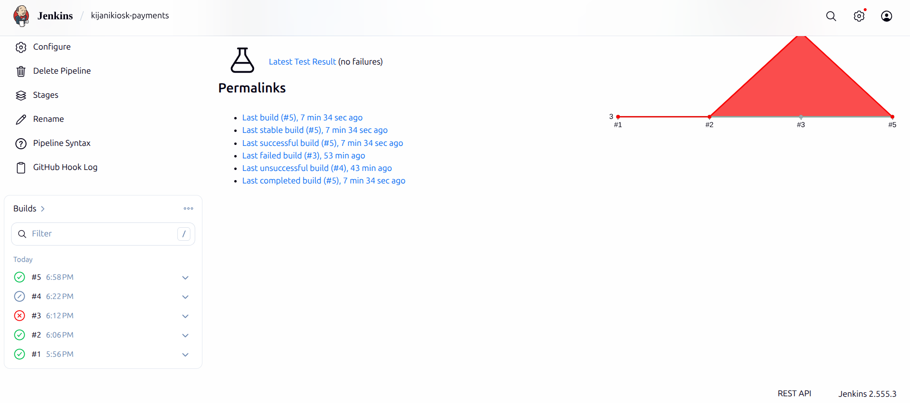
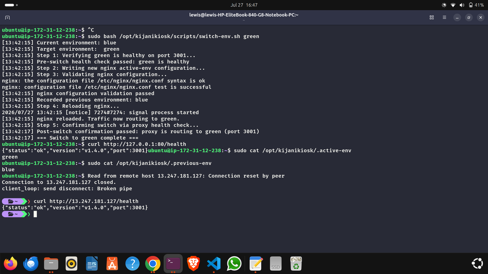
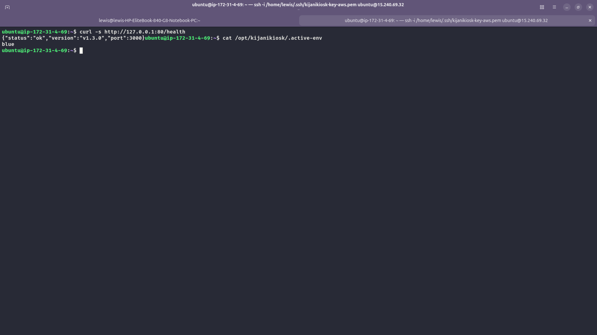
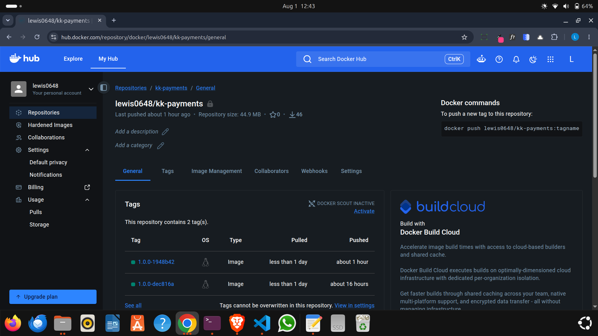
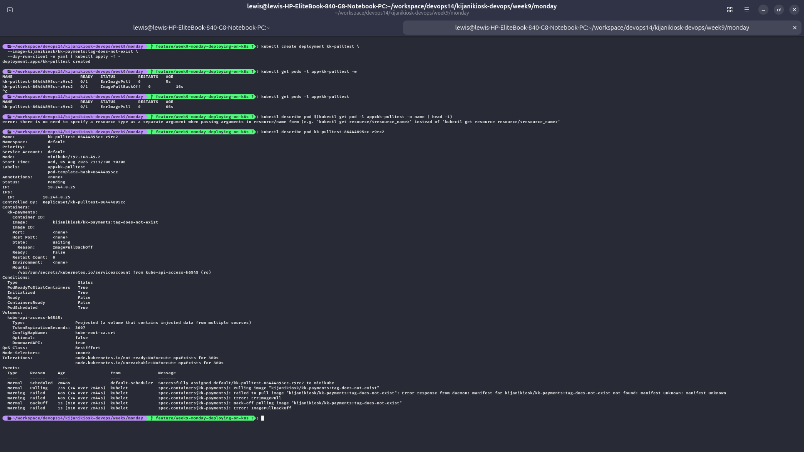
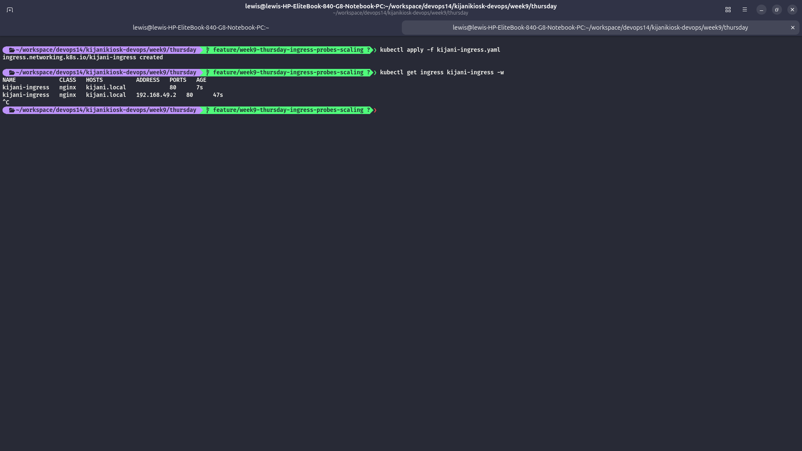
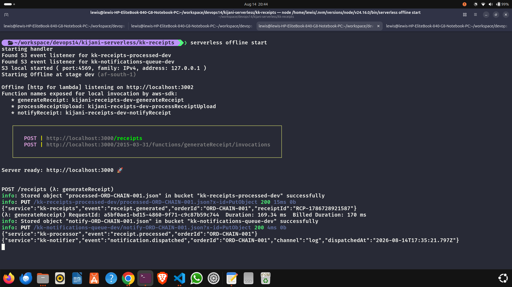
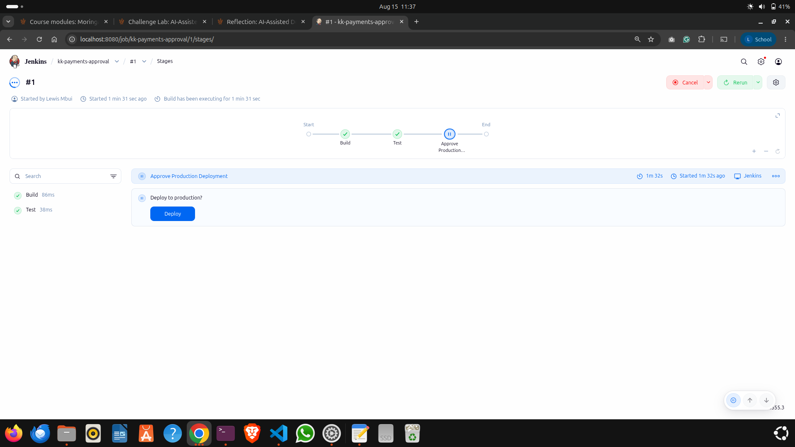

# KijaniKiosk DevOps Learning Journey

> A hands-on DevOps portfolio documenting my progression from Linux systems administration and Infrastructure as Code to CI/CD, deployment automation, containers, Kubernetes, serverless architecture, observability, incident response, and responsible AI-assisted operations.

This repository contains the practical work I completed during an intensive DevOps learning journey centered around **KijaniKiosk**, a fictional service-oriented application used to turn DevOps concepts into working infrastructure, deployment pipelines, operational tooling, failure scenarios, and engineering documentation.

Rather than treating each technology in isolation, the work progressively builds a delivery and operations story: first understanding and securing Linux systems, then provisioning infrastructure declaratively, automating configuration, building CI pipelines, designing safer deployment strategies, packaging applications as containers, orchestrating them with Kubernetes, extending the system with serverless components, and finally applying AI-assisted analysis with governance controls.

---

## Table of Contents

- [What This Repository Demonstrates](#what-this-repository-demonstrates)
- [Technology Stack](#technology-stack)
- [Learning Journey](#learning-journey)
  - [Week 3 — Linux Administration, Troubleshooting & Security](#week-3--linux-administration-troubleshooting--security)
  - [Week 4 — Infrastructure as Code with Terraform & Ansible](#week-4--infrastructure-as-code-with-terraform--ansible)
  - [Week 5 — Continuous Integration & Artifact Management](#week-5--continuous-integration--artifact-management)
  - [Week 7 — Deployment Automation, Blue/Green & Reliability](#week-7--deployment-automation-bluegreen--reliability)
  - [Week 8 — Containers & Kubernetes Foundations](#week-8--containers--kubernetes-foundations)
  - [Week 9 — Kubernetes Operations](#week-9--kubernetes-operations)
  - [Week 10 — Serverless Architecture, AIOps & Governance](#week-10--serverless-architecture-aiops--governance)
- [End-to-End DevOps Progression](#end-to-end-devops-progression)
- [Selected Engineering Highlights](#selected-engineering-highlights)
- [Repository Structure](#repository-structure)
- [Operational & Security Principles Practiced](#operational--security-principles-practiced)
- [Key Lessons](#key-lessons)
- [Production Readiness Perspective](#production-readiness-perspective)
- [About the Project](#about-the-project)

---

## What This Repository Demonstrates

The repository is evidence of practical experience across the DevOps lifecycle, including:

- Linux system administration, process inspection, resource troubleshooting, networking, users, groups, permissions, ACLs, systemd, journald, log rotation, and service hardening.
- Root-cause analysis using host metrics, logs, service state, and network evidence instead of relying on a single symptom.
- Infrastructure as Code using **Terraform** to provision AWS infrastructure and model reusable infrastructure through modules.
- Configuration management with **Ansible**, including inventories, host/group variables, Jinja2 templates, handlers, task decomposition, and idempotent configuration.
- CI/CD pipeline design using **Jenkins Declarative Pipeline**, including linting, builds, tests, security auditing, parallel stages, artifact archiving, credentials handling, and publishing to **Nexus**.
- Release engineering and deployment automation with Bash, versioned artifacts, checksums, health verification, idempotency, traffic switching, and rollback.
- Blue/green deployments with **nginx**, including pre-switch checks, atomic configuration changes, validation, traffic switching, and automated rollback.
- Reliability engineering using health signals, SLIs, SLOs, confidence windows, fault injection, monitoring thresholds, and post-incident reviews.
- Docker image construction, layer optimization, multi-stage builds, non-root execution, runtime-only dependencies, image health checks, private registries, and immutable version tags.
- Kubernetes Deployments, Services, namespaces, private image pulls, self-healing, resource requests/limits, debugging, rolling updates, rollbacks, ConfigMaps, Secrets, probes, Ingress, scaling, and production-readiness analysis.
- Serverless development with the **Serverless Framework**, AWS Lambda-style functions, HTTP APIs, S3 event triggers, asynchronous processing, local emulation, and environment-aware configuration.
- AIOps concepts through comparison of manual and AI-assisted incident analysis.
- Responsible AI governance through review of AI-generated Terraform for least privilege, encryption, secrets management, naming/tagging, auditability, and data residency.
- Git-based engineering practices using feature branches, commits, pull requests, and keeping declared configuration aligned with deployed state.

---

## Technology Stack

| Area                         | Tools / Concepts                                                                                 |
| ---------------------------- | ------------------------------------------------------------------------------------------------ |
| **Operating Systems**        | Ubuntu Linux, shell utilities, systemd, journald                                                 |
| **Scripting**                | Bash, AWK, curl, shell automation                                                                |
| **Infrastructure as Code**   | Terraform, AWS provider, modules, data sources, state                                            |
| **Configuration Management** | Ansible, inventories, variables, templates, handlers                                             |
| **Cloud**                    | AWS EC2, VPC networking concepts, S3, IAM, Lambda-style serverless workloads                     |
| **CI/CD**                    | Jenkins, Declarative Pipeline, Docker-based agents, pipeline gates                               |
| **Artifact Management**      | Nexus Repository, npm packages, versioned artifacts, checksums                                   |
| **Reverse Proxy / Routing**  | nginx, upstreams, active environment switching                                                   |
| **Containers**               | Docker, multi-stage builds, image layers, health checks, Docker Hub                              |
| **Orchestration**            | Kubernetes, kubectl, Deployments, Services, ConfigMaps, Secrets, Ingress                         |
| **Local Kubernetes**         | Minikube                                                                                         |
| **Serverless**               | Serverless Framework, serverless-offline, local S3 emulation                                     |
| **Reliability**              | Health checks, SLIs, SLOs, automated rollback, post-incident reviews                             |
| **Security**                 | Least privilege, Linux service hardening, firewall rules, secret separation, non-root containers |
| **AIOps / Governance**       | AI-assisted log analysis, human verification, Terraform governance review                        |
| **Version Control**          | Git, feature branches, pull requests, Git as desired-state source                                |

---

# Learning Journey

## Week 3 — Linux Administration, Troubleshooting & Security

**Focus:** building a strong systems foundation before automating infrastructure.

The first stage concentrated on understanding what is happening inside a Linux host and learning to make operational decisions from evidence.

### Incident triage and systems troubleshooting

I investigated a simulated KijaniKiosk API latency incident using operating-system and application evidence. The investigation checked CPU, memory, swap, disk usage, listening ports, HTTP behavior, process state, and logs.

The key lesson was that the most visible system symptom is not necessarily the root cause. Although the application was slow, the host itself still had healthy CPU, memory, and disk capacity. The stronger evidence pointed to **database connection-pool saturation**, request queuing, query timeouts, and eventual database connection failures.

This exercise established a troubleshooting approach I reused later in Kubernetes and AIOps work:

1. establish the current system state;
2. collect multiple independent signals;
3. build a timeline;
4. separate symptoms from causes;
5. only claim what the evidence supports.

### Linux access control and service isolation

The work also covered:

- dedicated service accounts;
- non-login users using `/usr/sbin/nologin`;
- groups and shared-access models;
- file and directory ownership;
- Unix permissions and ACLs;
- controlled sudo access;
- SUID analysis;
- principle of least privilege.

### Repeatable provisioning

I built a Bash provisioning script for the KijaniKiosk environment. It automated system setup while also including verification logic so the script did not merely execute commands—it checked whether the expected state had actually been achieved.

The repository contains both clean and deliberately “dirty” provisioning runs, which helped expose configuration assumptions and reinforce the importance of **idempotent automation**.

### systemd and host hardening

Services were hardened with systemd controls such as:

```ini
NoNewPrivileges=true
PrivateTmp=true
ProtectSystem=strict
ProtectHome=true
CapabilityBoundingSet=
```

Hardening was applied incrementally and tested after each change rather than simply maximizing restriction scores. This reinforced an important security principle: a control is useful only when it meaningfully reduces risk **without silently breaking required behavior**.

### Logging and operational hygiene

I also worked with:

- persistent journald configuration;
- log growth investigation;
- logrotate;
- reboot verification;
- post-remediation checks.

The final hardening documentation explicitly records tradeoffs and remaining gaps rather than presenting a lab environment as production-ready.

**Representative artifacts:**

- [`week3/monday/triage-report.md`](week3/monday/triage-report.md)
- [`week3/wednesday/kijanikiosk-provision.sh`](week3/wednesday/kijanikiosk-provision.sh)
- [`week3/wednesday/security-analysis.md`](week3/wednesday/security-analysis.md)
- [`week3/friday/hardening-decisions.md`](week3/friday/hardening-decisions.md)
- [`week3/friday/access-model-final.md`](week3/friday/access-model-final.md)

---

## Week 4 — Infrastructure as Code with Terraform & Ansible

**Focus:** moving from manual server setup to declarative, reproducible infrastructure and configuration.

Week 4 began by documenting desired state before writing automation. I first described what a KijaniKiosk server should look like—including identity, compute, networking, access control, storage, and authentication—and compared those requirements with manual provisioning decisions.

### Terraform

I then encoded infrastructure using Terraform and AWS resources.

The work progressed from a basic configuration into reusable modules and included:

- AWS provider configuration;
- dynamic AMI discovery using data sources;
- EC2 infrastructure;
- security groups;
- variables and outputs;
- reusable modules;
- `for_each` to provision API, payments, and logs servers from a common module;
- planning before application;
- state inspection;
- drift detection;
- controlled destruction and teardown.

A simplified example of the reusable server model is:

```hcl
module "app_servers" {
  source   = "./modules/app_server"
  for_each = local.servers

  name          = "kijanikiosk-${each.key}-${var.environment}"
  service       = each.key
  instance_type = each.value.instance_type
  environment   = var.environment
}
```

This shifted the mindset from “run the right commands on the server” to “describe the state the infrastructure should converge toward.”

### Ansible

Terraform provisioned infrastructure; Ansible handled operating-system and application configuration.

The Ansible implementation was broken into explicit phases for:

- packages;
- users;
- directories;
- deployment mechanism;
- systemd services;
- firewall configuration;
- persistent journald;
- log rotation.

The playbooks use:

- inventory groups;
- host variables and group variables;
- reusable task files;
- Jinja2 templates;
- handlers;
- systemd integration;
- nginx configuration;
- check/dry-run behavior;
- idempotency verification.

Running the playbook a second time without a desired-state change demonstrated why idempotency matters: infrastructure automation should be safe to execute repeatedly.

### IaC pipeline

The week concluded by connecting Terraform and Ansible through an infrastructure pipeline. This demonstrated the distinction between:

- **provisioning infrastructure**; and
- **configuring software and operating-system state on that infrastructure**.

**Representative artifacts:**

- [`week4/monday/desired-state-spec-aws.md`](week4/monday/desired-state-spec-aws.md)
- [`week4/tuesday/main.tf`](week4/tuesday/main.tf)
- [`week4/wednesday/modules/app_server/`](week4/wednesday/modules/app_server/)
- [`week4/friday/terraform/`](week4/friday/terraform/)
- [`week4/friday/ansible/`](week4/friday/ansible/)
- [`week4/friday/pipeline.sh`](week4/friday/pipeline.sh)

---

## Week 5 — Continuous Integration & Artifact Management

**Focus:** creating a repeatable quality gate from source code to a versioned artifact.

Week 5 introduced Jenkins and the idea that a delivery pipeline should be more than a sequence of shell commands. A useful CI pipeline should make failures visible, prevent low-quality builds from advancing, manage credentials safely, preserve evidence, and produce immutable artifacts.

### Jenkins Declarative Pipeline

The final Jenkins pipeline includes stages for:

```text
Lint → Build → Verify → Archive → Publish
```

The **Verify** stage runs test and security checks in parallel.

Key practices implemented include:

- Docker-based Jenkins build agents;
- `npm ci` for reproducible dependency installation;
- linting;
- application build verification;
- automated tests;
- JUnit test-result publishing;
- `npm audit --audit-level=high`;
- parallel pipeline stages;
- Jenkins `stash` / `unstash`;
- artifact archiving and fingerprinting;
- pipeline timeouts;
- build retention;
- disabling concurrent builds;
- workspace cleanup;
- post-build success/failure notifications.

### Immutable artifact versioning

Artifacts were versioned using both application SemVer and the Git short SHA:

```text
<package-version>-<git-short-sha>
```

This creates a direct link between an artifact and the source commit that produced it.

### Nexus artifact repository

The pipeline publishes versioned npm artifacts to a Nexus repository instead of treating the Jenkins workspace as the delivery mechanism.

Credentials are injected through Jenkins credentials and temporary authentication files are removed even when publishing fails.

### Failure injection

I deliberately created red builds and pipeline failures to test whether the pipeline failed in the correct stage and prevented unsafe publication.

This reinforced a recurring theme throughout the course: **failure behavior is part of the design**.



**Representative artifacts:**

- [`week5/friday/Jenkinsfile`](week5/friday/Jenkinsfile)
- [`week5/friday/fault-injection-log.md`](week5/friday/fault-injection-log.md)
- [`week5/friday/credential-audit.txt`](week5/friday/credential-audit.txt)
- [`week5/friday/ci-pipeline-board-document.md`](week5/friday/ci-pipeline-board-document.md)
- [`week5/friday/reflection.md`](week5/friday/reflection.md)

---

> **Repository note:** the checked-in learning folders move from `week5/` to `week7/`. There is no `week6/` lab directory in the repository, so this README only documents work that is actually represented by the code, evidence, and Git history.

---

## Week 7 — Deployment Automation, Blue/Green & Reliability

**Focus:** reducing release risk and making deployment failure recoverable.

After CI had produced versioned artifacts, the next problem was safely getting those artifacts into a running environment.

### Deployment strategy analysis

I compared deployment strategies against different workload characteristics rather than assuming one strategy is best for every application. The work considered the tradeoffs around rollout speed, rollback time, infrastructure cost, and availability.

### Automated artifact deployment

A Bash deployment script was created for `kk-api` with explicit phases:

```text
Fetch → Validate → Deploy → Restart → Verify
```

The deployment automation includes:

- required environment-variable validation;
- versioned release paths;
- remote artifact retrieval;
- optional SHA-256 checksum verification;
- extraction into a staging directory;
- artifact structure validation;
- repeatable deployment behavior;
- service restart;
- application version verification through `/health`;
- useful exit codes and operational logging.

The script was tested with successful deployments, repeat runs, artifact-fetch failures, and health-verification failures.

### Blue/green deployment with nginx

The KijaniKiosk API was then operated as two simultaneously available environments:

```text
                 ┌──────────────┐
Client ──► nginx ┤ Active route ├──► Blue :3000
                 └──────┬───────┘
                        └──────────► Green :3001
```

The switch process:

1. determines the active environment;
2. validates the target environment;
3. confirms target health before switching;
4. writes a new nginx route;
5. runs `nginx -t` before reloading;
6. records the previous environment;
7. reloads nginx;
8. verifies traffic through the proxy.

The script also prevents concurrent switching with a lock and supports idempotent behavior when the requested environment is already active.



### Rollback and post-deployment monitoring

A rollback script restores traffic to the previously active environment.

I then added a post-deployment confidence window that continuously checks:

- HTTP status;
- consecutive health failures;
- errors within a polling window;
- response latency.

If configured thresholds are breached, rollback is triggered automatically.



### SLIs, SLOs and post-incident review

Reliability work also included defining service-level indicators/objectives and documenting a structured post-incident review using a timeline, contributing factors, Five Whys, prevention mechanisms, and follow-up actions.

**Representative artifacts:**

- [`week7/tuesday/scripts/deploy-app.sh`](week7/tuesday/scripts/deploy-app.sh)
- [`week7/wednesday/scripts/switch-env.sh`](week7/wednesday/scripts/switch-env.sh)
- [`week7/wednesday/scripts/rollback.sh`](week7/wednesday/scripts/rollback.sh)
- [`week7/thursday/scripts/post-deploy-monitor.sh`](week7/thursday/scripts/post-deploy-monitor.sh)
- [`week7/thursday/slo-document.md`](week7/thursday/slo-document.md)
- [`week7/thursday/post-incident-review.md`](week7/thursday/post-incident-review.md)

---

## Week 8 — Containers & Kubernetes Foundations

**Focus:** moving from server-oriented deployment to immutable application packaging and declarative orchestration.

### Docker fundamentals

I first explored Docker image layering and the relationship between Dockerfile instructions, cached layers, image size, and build behavior.

This led to a production-oriented multi-stage Dockerfile for `kk-payments`.

### Production multi-stage image

The final image separates build-time and runtime concerns:

```dockerfile
FROM node:18-alpine AS builder
# install dependencies and compile application

FROM node:18-alpine AS production
# install runtime dependencies only
# copy compiled output only
# run as non-root user
```

The production stage:

- installs only runtime dependencies;
- copies only compiled output;
- runs under a dedicated non-root account;
- defines an application health check;
- exposes only the required application port.

This reduced the final production image substantially compared with the initial single-stage development image and reduced the amount of unnecessary software shipped into production.

### Private registry and image tags

Images were tagged with a version and source identifier and pushed to Docker Hub. Kubernetes authentication was handled through an `imagePullSecret` rather than embedding registry credentials in workload manifests.



### Kubernetes object model

I then deployed `kk-payments` using a Kubernetes `Deployment` and exposed it through a `Service`.

The deployment defined:

- two replicas;
- image pull credentials;
- container ports;
- application environment variables;
- CPU and memory requests;
- CPU and memory limits.

The Service routed traffic to Pods using labels rather than individual Pod IP addresses.

### Self-healing

A Pod was deliberately deleted while the application was running. Kubernetes created a replacement to restore the desired replica count while another replica continued serving traffic.

The exercise demonstrated the practical difference between manually operating processes and declaring the state an orchestrator should maintain.

**Representative artifacts:**

- [`week8/monday/Dockerfile`](week8/monday/Dockerfile)
- [`week8/tuesday/Dockerfile.production`](week8/tuesday/Dockerfile.production)
- [`week8/wednesday/kk-payments-private-pod.yaml`](week8/wednesday/kk-payments-private-pod.yaml)
- [`week8/thursday/kk-payments-deployment.yaml`](week8/thursday/kk-payments-deployment.yaml)
- [`week8/thursday/kk-payments-service.yaml`](week8/thursday/kk-payments-service.yaml)
- [`deployment-pipeline/comparison.md`](deployment-pipeline/comparison.md)

---

## Week 9 — Kubernetes Operations

**Focus:** operating, troubleshooting, updating, configuring, exposing, and scaling applications in Kubernetes.

Week 9 moved beyond creating Kubernetes objects into understanding how they behave under failure and change.

### Kubernetes troubleshooting

I deliberately created and diagnosed common failure states:

- `ImagePullBackOff`;
- `CrashLoopBackOff`;
- `OOMKilled`.

The diagnostic workflow used commands such as:

```bash
kubectl get pods
kubectl describe pod <pod>
kubectl logs <pod>
kubectl logs --previous <pod>
kubectl get events
```

The important lesson was that `STATUS` is only a summary. Events, container state, termination reason, exit code, and previous-container logs provide the evidence needed to determine why a workload is failing.



### Rolling updates and rollback

The deployment strategy was configured as:

```yaml
strategy:
  type: RollingUpdate
  rollingUpdate:
    maxSurge: 1
    maxUnavailable: 1
```

I performed:

- a controlled version update;
- a deliberately broken deployment;
- rollout observation;
- rollout history inspection;
- targeted rollback to a known-good revision.

A key operational lesson was that a rollback changes live cluster state, but Git must also be corrected afterward. Otherwise the next `kubectl apply` can reintroduce the broken desired state.

### ConfigMaps and Secrets

Application configuration was removed from the Deployment manifest and split into:

- a **ConfigMap** for non-sensitive configuration; and
- a **Secret** for values such as database passwords, API keys, and JWT secrets.

The real Secret is intentionally not committed. Only an example manifest documenting the required keys is kept in Git.

I also verified the behavior difference between updating a ConfigMap and an already-running process using environment variables: changing the ConfigMap alone does not mutate the process environment; a rollout restart is required for new Pods to receive those environment values.

### Ingress routing

An nginx Ingress routes a shared hostname by path:

```text
http://kijani.local/payments/...  → kk-payments-service
http://kijani.local/api/...       → kk-api
```

The manifest uses regex path matching and URL rewriting so multiple backend services can share a single ingress point.



### Readiness, liveness and resources

`kk-payments` was enhanced with:

- readiness probes;
- liveness probes;
- resource requests;
- resource limits.

This connected application-level health signals with Kubernetes scheduling and recovery behavior.

### Scaling and HPA concepts

The service was manually scaled to six replicas and individual Pod IPs were observed to reinforce that Services route to a changing set of endpoints.

The work also examined the requirements for Horizontal Pod Autoscaling, including metrics-server and the importance of CPU requests as the utilization baseline.

### Production-readiness assessment

The final Kubernetes work explicitly assessed remaining production gaps, including:

- TLS termination;
- HTTPS redirects;
- rate limiting;
- authentication/API gateway controls;
- realistic probe tuning;
- load testing;
- autoscaling thresholds.

**Representative artifacts:**

- [`week9/monday/reflection.md`](week9/monday/reflection.md)
- [`week9/tuesday/kk-payments-deployment.yaml`](week9/tuesday/kk-payments-deployment.yaml)
- [`week9/wednesday/kk-payments-configmap.yaml`](week9/wednesday/kk-payments-configmap.yaml)
- [`week9/wednesday/kk-payments-secrets.yaml.example`](week9/wednesday/kk-payments-secrets.yaml.example)
- [`week9/thursday/kijani-ingress.yaml`](week9/thursday/kijani-ingress.yaml)
- [`prod-readiness-assessment.md`](prod-readiness-assessment.md)
- [`k8s/`](k8s/)

---

## Week 10 — Serverless Architecture, AIOps & Governance

**Focus:** event-driven architecture, local serverless development, AI-assisted operations, and responsible use of AI-generated infrastructure.

### Serverless fundamentals

I created a `kijani-receipts` service using the Serverless Framework and a Node.js runtime.

The initial function exposed:

```text
POST /receipts
```

and was tested both through direct local invocation and `serverless-offline`.

### Asynchronous event processing

The system then evolved into an event-driven workflow using S3-style events.

The final local chain is conceptually:

```text
HTTP request
    │
    ▼
generateReceipt
    │ writes object
    ▼
Processed S3 bucket
    │ ObjectCreated
    ▼
processReceiptUpload
    │ writes notification object
    ▼
Notification S3 bucket
    │ ObjectCreated
    ▼
notifyReceipt
    │
    ▼
Structured notification log
```

The implementation uses:

- `serverless-offline` for local HTTP/Lambda development;
- `serverless-s3-local` for local S3 event emulation;
- stage-aware variables;
- environment variables;
- S3 event filters;
- multiple handlers;
- asynchronous decoupling;
- structured logs;
- malformed-key / edge-case testing.



### Infrastructure definitions

The Serverless configuration declares the service, functions, events, bucket names, runtime settings, local endpoints, and S3 resources in one place. This extends the IaC mindset beyond virtual machines and Kubernetes manifests into event-driven cloud architecture.

### AI-assisted incident analysis

A production-style `kk-payments` incident log was first analyzed manually and then analyzed with an AI assistant.

The comparison evaluated whether AI correctly identified:

- the first signal of degradation;
- database connection-pool exhaustion;
- the ineffectiveness of scaling the application against a database bottleneck;
- an attempted ConfigMap remediation that made no effective value change;
- the difference between recovery and confirmed incident resolution.

The AI and manual analysis substantially agreed, but the exercise emphasized a crucial operational principle:

> AI can accelerate interpretation of evidence, but it should not replace observability, engineering judgment, or verification.

### Human approval gates

A Jenkins pipeline was extended with an explicit production approval stage using Jenkins `input`, demonstrating that automation does not imply removing human judgment from every high-risk action.



### AI governance for Infrastructure as Code

An AI-generated Terraform module was reviewed against six governance controls:

1. least privilege;
2. encryption;
3. secrets management;
4. naming and tagging;
5. auditability;
6. data residency.

The review identified serious issues such as wildcard S3 permissions, hard-coded production credentials, an inappropriate AWS region, missing encryption controls, and insufficient governance metadata.

This final exercise reinforced that generated infrastructure must be treated as **untrusted proposed code** until an engineer reviews and validates it.

**Representative artifacts:**

- [`week10/monday/serverless.yml`](week10/monday/serverless.yml)
- [`week10/wednesday/serverless.yml`](week10/wednesday/serverless.yml)
- [`week10/wednesday/handlers/`](week10/wednesday/handlers/)
- [`week10/thursday/log-analysis-comparison.md`](week10/thursday/log-analysis-comparison.md)
- [`week10/thursday/Jenkinsfile`](week10/thursday/Jenkinsfile)
- [`week10/thursday/governance-review.md`](week10/thursday/governance-review.md)
- [`week10/thursday/risk-mitigation.md`](week10/thursday/risk-mitigation.md)

---

# End-to-End DevOps Progression

One of the most valuable aspects of this repository is that later work builds directly on earlier work.

```text
Linux & Troubleshooting
        │
        ▼
Security & Repeatable Provisioning
        │
        ▼
Terraform Infrastructure
        │
        ▼
Ansible Configuration
        │
        ▼
Jenkins CI + Nexus Artifacts
        │
        ▼
Deployment Automation
        │
        ▼
Blue/Green + Rollback + SLOs
        │
        ▼
Docker Images
        │
        ▼
Kubernetes Deployment & Self-Healing
        │
        ▼
Kubernetes Operations & Ingress
        │
        ▼
Serverless Event Processing
        │
        ▼
AI-Assisted Operations + Governance
```

The progression changed how I approached the same operational problems:

| Problem                      | Earlier approach              | Later approach                                   |
| ---------------------------- | ----------------------------- | ------------------------------------------------ |
| Provision a server           | Shell/manual setup            | Terraform desired state                          |
| Configure a host             | Provisioning script           | Idempotent Ansible playbooks                     |
| Build an application         | Local command                 | Jenkins quality pipeline                         |
| Store a release              | Build workspace               | Versioned Nexus / registry artifact              |
| Deploy a version             | Replace application on a host | Versioned deployment automation                  |
| Reduce release risk          | Manual restart                | Blue/green traffic switching                     |
| Recover from bad release     | Engineer-driven change        | Automated rollback / Kubernetes rollout undo     |
| Recover from process failure | Restart service               | Kubernetes self-healing                          |
| Configure applications       | Inline environment values     | ConfigMaps + externalized Secrets                |
| Expose services              | Direct port                   | Service + Ingress routing                        |
| Process background work      | Tightly coupled request flow  | Event-driven serverless chain                    |
| Diagnose incidents           | Manual evidence analysis      | Manual analysis augmented by AI                  |
| Generate infrastructure      | Engineer writes all code      | AI may assist, but engineer governs and approves |

---

# Selected Engineering Highlights

## 1. Failure was deliberately tested

The repository contains examples of deliberately induced failures across multiple layers:

- CI red builds;
- failed artifact retrieval;
- failed application health verification;
- failed blue/green switching;
- post-deployment fault injection;
- `ImagePullBackOff`;
- `CrashLoopBackOff`;
- `OOMKilled`;
- broken Kubernetes rolling updates;
- malformed serverless event keys;
- unsafe AI-generated Terraform.

This was important because reliable systems are not defined only by how they behave when everything succeeds.

## 2. Git was treated as engineering history

The repository uses incremental commits, feature branches, and pull-request merges throughout the learning journey.

The Kubernetes rollback exercise also demonstrated why Git must remain aligned with runtime desired state: fixing a cluster manually without fixing the committed manifest leaves the failure ready to be re-applied later.

## 3. Security was introduced at multiple layers

Security work was not confined to a single “security week.” It appears throughout the repository:

- least-privilege Linux accounts;
- explicit ownership and ACLs;
- hardened systemd services;
- firewall configuration;
- secure Jenkins credential injection;
- non-root Docker containers;
- private registry authentication;
- separation of ConfigMaps and Secrets;
- no real Kubernetes secret values committed;
- production TLS/rate-limit recommendations;
- least-privilege IAM governance review;
- hard-coded secret detection in generated IaC.

## 4. Observability preceded automation

Health checks, logs, status codes, response time, rollout status, events, and structured logs repeatedly serve as inputs to automated decisions.

This became especially clear in Week 10: AI-assisted incident analysis is only as trustworthy as the telemetry and evidence available to it.

---

# Repository Structure

```text
kijanikiosk-devops/
├── week3/                    # Linux administration, triage, provisioning, hardening
├── week4/                    # Terraform, Ansible and IaC pipeline
├── week5/                    # Jenkins CI/CD and Nexus artifact management
├── week7/                    # Deployment automation, blue/green, rollback, SLOs
├── week8/                    # Docker, private images, Kubernetes foundations
├── week9/                    # Kubernetes troubleshooting and operations
├── week10/                   # Serverless, event-driven workflows, AIOps, governance
│
├── deployment-pipeline/
│   ├── bluegreen/            # Consolidated blue/green deployment evidence
│   ├── containers/           # Container/Kubernetes deployment progression
│   └── comparison.md         # Blue/green vs container-based deployment analysis
│
├── k8s/                      # Consolidated KijaniKiosk Kubernetes manifests
├── prod-readiness-assessment.md
└── README.md
```

Each week contains a mixture of executable code/configuration and engineering evidence, including:

- scripts;
- Terraform files;
- Ansible playbooks;
- Jenkinsfiles;
- Dockerfiles;
- Kubernetes YAML;
- Serverless manifests;
- command outputs;
- screenshots;
- reflections;
- design reviews;
- incident reports;
- security and governance decisions.

---

# Operational & Security Principles Practiced

Throughout the repository, I repeatedly applied the following principles:

### Declarative over manual

Where possible, infrastructure and application state should be represented as code that can be reviewed, repeated, versioned, and reconciled.

### Idempotency

Automation should be safe to run repeatedly. A second execution with no intended change should not create unnecessary changes or unpredictable side effects.

### Immutable and traceable releases

Release artifacts should have unique identifiers that can be traced back to source code. Rebuilding “the same” version later is weaker than preserving the exact artifact that passed the pipeline.

### Least privilege

Users, services, containers, CI credentials, and cloud roles should have only the permissions they require.

### Health before traffic

A process being started is not enough. A deployment should prove that the application can serve its intended workload before receiving traffic.

### Automate recovery where evidence is strong

Known, measurable failure conditions can safely trigger automated recovery, as demonstrated with blue/green rollback and Kubernetes reconciliation.

### Keep humans in high-risk decision loops

Production approval gates and AI governance reviews demonstrate that some decisions deserve explicit human accountability.

### Do not confuse recovery with root-cause resolution

A system may begin returning successful requests while the underlying condition remains close to failure. Incident closure requires sustained evidence, not just a single successful request.

### Document tradeoffs and gaps

A lab can be successful while still not being production-ready. The repository deliberately documents missing TLS, secrets-management dependencies, scaling limitations, monitoring gaps, and other risks.

---

# Key Lessons

The course changed my understanding of DevOps from “knowing deployment tools” into a broader engineering discipline.

A few lessons stand out:

1. **Troubleshooting starts with evidence.** CPU, memory, logs, events, health endpoints, and timelines are more reliable than assumptions.
2. **Automation without verification is incomplete.** A command succeeding does not prove the service is healthy.
3. **Infrastructure as Code is as much about reviewability and reproducibility as it is about speed.**
4. **CI is a quality gate, not simply a build server.** A good pipeline should prevent unsafe artifacts from progressing.
5. **A rollback strategy must exist before a deployment fails.**
6. **Containers package applications; Kubernetes manages desired runtime state.** These solve related but different problems.
7. **Kubernetes abstractions are most valuable during change and failure.** Rolling updates, Services, probes, resource controls, and reconciliation become meaningful when something breaks.
8. **Secrets require an operational lifecycle outside Git.** Excluding secrets from a repository is correct, but a secure recovery/source-of-truth process must exist elsewhere.
9. **Serverless architecture changes the unit of deployment and encourages event-driven decoupling.**
10. **AI can improve operational speed, but accountability remains with the engineer.** Generated answers and generated infrastructure must be grounded, reviewed, and governed.

---

# Production Readiness Perspective

This repository is a learning and portfolio environment, not a claim that the KijaniKiosk platform is production-ready.

The exercises intentionally identify areas that a real production system would still require, such as:

- managed secret storage and rotation;
- TLS and certificate lifecycle management;
- stronger ingress/API security controls;
- centralized metrics, logs, dashboards, and alerting;
- persistent production data stores and backup strategy;
- disaster recovery planning;
- fully tested autoscaling policies;
- production load and resilience testing;
- stronger policy-as-code and security scanning;
- cloud IAM hardening;
- production-grade serverless deployment and observability;
- formal change-management and approval policy.

Recognizing these gaps is part of the engineering outcome: **successful automation is not the same thing as production readiness.**

---

# About the Project

**KijaniKiosk** served as the common system used throughout the learning journey. Its services—particularly `kk-api`, `kk-payments`, and later `kijani-receipts`—provided a consistent context in which to apply progressively more advanced DevOps practices.

The repository therefore tells one connected story rather than a collection of unrelated tutorials:

> **Understand the system → define desired state → automate infrastructure → automate quality → automate deployment → design rollback → package immutably → orchestrate declaratively → operate through evidence → extend with event-driven architecture → use AI responsibly.**

That progression is the main outcome of this project and represents the DevOps foundation I will continue building on in future software and infrastructure work.

---

## Final Note

All credentials and sensitive values shown in example files should be treated as lab/demo data only. Real production secrets should never be committed to source control.
